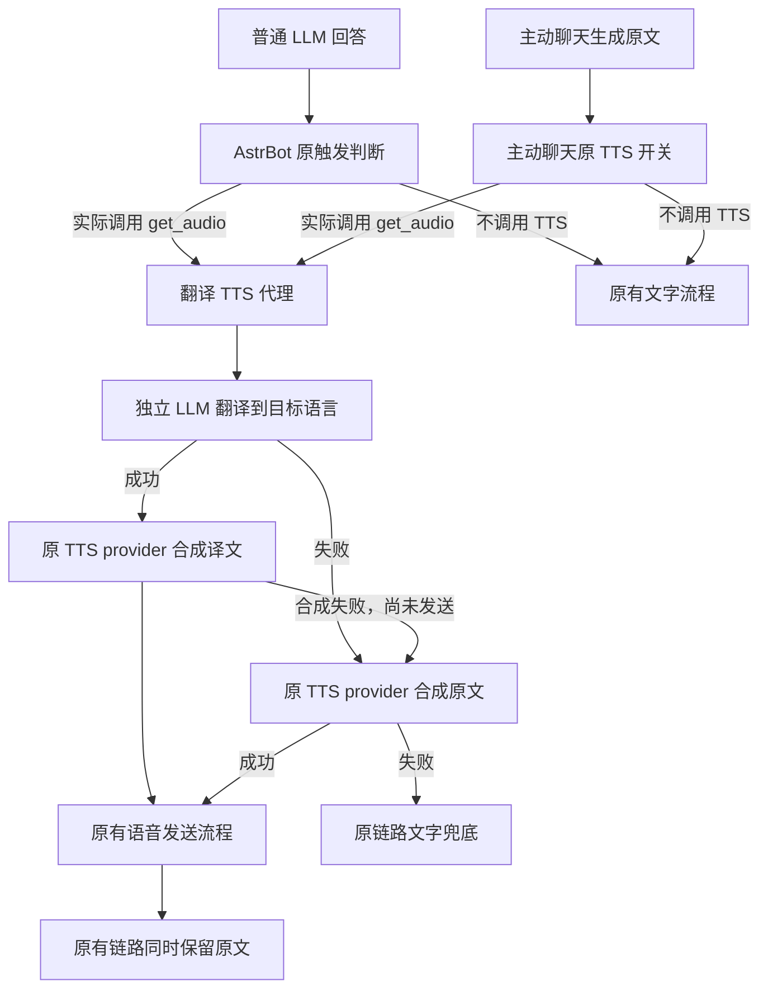

# AstrBot 翻译 TTS 插件开发计划

日期：2026-09-06  
计划状态：阶段 1–3 已实现并完成模拟测试；阶段 5 文档与静态检查已完成；阶段 4 真实 QQ、真实模型及语音播放联调待用户授权环境。  
建议插件标识：`astrbot_plugin_translate_tts`  
基线：AstrBot `4.27.5`，QQ 官方机器人，非流式回答。

## 1. 已确认的行为契约

| 项目 | 行为 |
| --- | --- |
| 普通回答 | 只有原有链路实际调用 TTS 时才翻译，不新增语音触发条件 |
| 文本 | 保留原语言回答，触发语音后强制同时输出原文，即使原设置为仅语音 |
| 语音 | 翻译原本将送入 TTS 的文本，交给原本选中的 TTS provider |
| 翻译模型 | 插件 WebUI 可独立选择已配置的 LLM provider |
| 目标语言 | 默认日语，可选择其他语言或填写自定义语言；每次只使用一个目标语言 |
| 翻译失败 | 使用原文本调用原 TTS provider；原文依然保留 |
| 主动聊天 | `astrbot_plugin_proactive_chat` 原本进入 TTS 的主动消息应用同样规则 |
| 实现边界 | 不修改 AstrBot 或主动聊天插件的磁盘源码；允许可撤销的运行时适配 |

以下是本计划采用的具体默认值，属于可调整的实现选择：翻译 provider 留空时复用当前会话聊天 provider；目标语言为全局配置，不增加会话指令或语言路由；翻译结果不显示、不写入聊天历史。原文保留指不因翻译而改写回答，现有前缀、分段和其他插件的正常装饰继续生效。

“一个目标语言”不改变原有语音分段：上游原本逐段调用 TTS 时，各段都翻译到同一目标语言，不额外合并音频。文字与语音的发送顺序沿用原链路，不承诺文字先到。

本期不增加独立 TTS 服务、音色管理、流式翻译、语音识别、多语言同时播报、跨会话缓存或独立 WebUI。目标语言能否正常发音取决于所选 TTS 模型及音色的能力，插件不能仅靠翻译文本为单语模型增加语言能力。

## 2. 阶段 0：文档发现与基线固定

### 2.1 本轮已核实的事实

1. 普通回答的 `on_decorating_result` 在 TTS 判断之前；真正的转换调用为 `get_audio(comp.text)`，文字是否保留由 `dual_output` 控制。仅使用该钩子不足以满足精确触发与原文保留要求。[S1]
2. 主动聊天有独立的 `_send_proactive_message`：同步取得 TTS provider 后调用 `get_audio(text)`，随后才执行装饰钩子；另由 `always_send_text` 决定文字发送。[S4]
3. 翻译可使用 `Context.llm_generate`；普通链路使用异步 TTS getter，主动聊天当前源码使用同步 getter。[S2]
4. QQ 官方适配器在 4.27.5 中实际实现了 `send_by_session` 及群聊、C2C 语音发送；不能依据 `Context.send_message` 中未同步的旧注释判定主动发送不可用。[S5]
5. 普通发送阶段会分开发送 `Record`。本插件应继续使用已有平台发送链，而非在翻译函数内直接发送消息。[S3]

主动聊天的调研基线已通过只读检出固定为 **v1.2.5**、commit **`d1203524f29be248a4975bac1f7586e9557434ee`**。本机磁盘安装的 v1.2.5 四个固定文件已与该基线的 SHA-256 指纹匹配；当前没有 AstrBot 后端进程，也没有可核验的已加载主动聊天实例，因此磁盘结果不能归因到运行实例。不宣称兼容其他历史版本或未来版本。

### 2.2 已确认可使用的 API / 适配点

| API / 位置 | 用途 | 属性 |
| --- | --- | --- |
| `Context.llm_generate(*, chat_provider_id, prompt=None, system_prompt=None, contexts=None, tools=None, **kwargs)` | 独立翻译，读取返回值 `completion_text` | 公开 API，[S2] |
| `await Context.get_current_chat_provider_id(umo)` | 未选择翻译模型时解析会话模型 | 公开 API，[S2] |
| `await Context.get_using_tts_provider_async(umo=None)` | 包装普通路径实际选中的 TTS provider | 公开方法，包装行为由插件实现，[S2] |
| `Context.get_using_tts_provider(umo=None)` | 兼容主动聊天已有同步调用 | 已弃用但基线中仍存在，只作兼容，[S2] |
| `ResultDecorateStage.process(self, event)` | 建立普通回复作用域并在装饰结束后补回文字 | 内部异步生成器，需版本保护，[S1] |
| `SenderMixin._send_proactive_message(self, session_id, text)` | 建立主动消息作用域 | 第三方内部方法，[S4] |
| `ConfigMixin._get_session_config(self, session_id: str) -> dict \| None` | 同步返回本次会话配置，对匹配调用复制配置以保证文字输出 | 第三方内部接口，[S8] |
| 主动聊天 `_send_chain_with_hooks(session_id, components)` | 保留原装饰、发送和流水处理 | 调用原实现，[S4] |
| `_conf_schema.json` 的 `_special: select_provider` | 配置翻译模型选择器 | 配置文档，[S6] |

### 2.3 实施前补齐

- 固定 AstrBot 4.27.5 源码及主动聊天参考版本，记录 commit、相关方法签名和调用顺序到 `docs/compatibility.md`。运行时元数据不提供可信 commit/源码指纹，因此仅通过版本与签名的实例必须标为 `signature_compatible_unverified`；另以只读源码探针核对指定 checkout，不能把探针结果自动归因到已加载实例。
- 本机非敏感配置投影已核实只有一个已启用的 `qq_official` 平台；群聊/C2C 仍需真实验收。若联调时实际启用 Webhook，同步核对其源码并加入同等用例。
- 核实插件加载、重载与 `terminate()` 生命周期、会话插件启用范围的判定方式，以及第三方实例与实际方法所属类的定位方式。
- 普通与主动适配使用统一状态结构，区分签名兼容但源码未核验、未安装/停用、显式禁用、不兼容、关闭及被新代次替换；诊断不能只显示整个插件“已加载”。

**验证**：形成确定版本的调用链记录，方法签名检查可通过，明确每个补丁所作用的对象。  
**禁止**：虚构 `on_before_tts` 等未核实的钩子；从其他 AstrBot 版本推断此版本的内部结构；为了完成调研而修改用户运行配置。

## 3. 技术方案

### 3.1 总体结构

采用“调用作用域 + TTS provider 代理 + 两条链路的文字保留适配”。代理仅替换送入 TTS 的参数，不替换主 LLM 回答。



图中的模块已按后续文件落地；阶段 4 的真实环境端到端验证仍未执行。

### 3.2 作用域与 provider 代理

新增 `TranslationScope`，通过 `contextvars.ContextVar` 保存本次调用状态：来源类型、完整会话标识、所属插件实例、配置快照、原文段记录、处理状态和活动标志。

- 普通来源只在 `ResultDecorateStage.process` 执行期间启用，且检查本插件在该事件中的启用范围及非流式条件。
- 主动来源只在已识别实例的 `_send_proactive_message` 内启用；会话策略通过已核实的配置接口解析，不能默认绕过会话禁用设置。
- getter 首先执行原方法取得真实 provider；仅在所属 Context、会话和活动作用域匹配时返回轻量代理。其他调用原样返回真实对象。
- 不把代理写入 provider 管理器，不修改共享 provider 实例，不覆盖所有 TTS 子类的 `get_audio`。
- 代理保留原方法调用约定及参数，只替换本次文本输入。未知签名或无法安全绑定参数时透传原调用。
- 作用域外取得的代理即使被保存后再次使用，也必须在无有效匹配作用域时透传。
- 异步生成器包装要在真正迭代时生效；每次推进原生成器都设置和复原 ContextVar，在向外 `yield` 前复原，并在退出时关闭生成器、使作用域失效。不能仅在创建生成器对象时设置变量。
- 不使用“最后一次 event”或全局文本变量；普通与主动调用同时运行时不串会话。

### 3.3 翻译与合成

内部拟定接口：

```python
async def translate_for_tts(source_text: str, scope: TranslationScope) -> str: ...


async def synthesize_with_translation(
    original_get_audio, source_text, scope, *args, **kwargs
): ...
```

翻译使用稳定的系统提示词，要求保留含义、语气、称谓及数字，只输出可朗读的目标语言译文；明确输入文本是待翻译材料，其中的指令不应被执行。待翻译原文置于用户消息部分，不拼入主会话系统提示词。

调用采用独立 `llm_generate`，不带聊天历史、人格、图片、音频或工具，不调用 Agent 循环，不把结果追加到 conversation。翻译 provider 已明确配置却失效时，直接回退原文 TTS，不偷偷换另一个模型。

只做轻量输出验证：结果存在、正文非空、没有要求继续工具调用、长度处于上限内；不通过“含有汉字”判定日语失败。译文为模型输出，自动检查不承诺语义完全准确，验收时以有限样例人工核对。

对输入和输出分别设置长度上限，超限使用完整原文走 TTS，不截断原回答。翻译超时覆盖等待并发名额的时间，默认不自动重试翻译。翻译异常仅捕获普通异常；取消请求继续传播，不能在取消后又发起回退合成。

### 3.4 普通链路的原文保留

继续执行原 `ResultDecorateStage.process`，不复制随机概率判断，不提前翻译。

在实际代理调用时记录本次被处理的原文段、段序号和来源组件，原函数结束后仅补回因本次 TTS 转换而消失的 `Plain`。已保留的文字不再追加；原本就存在的 `Record`、图片、引用和提及不作处理。

通过本次转换账本和新生成组件关联补回，不能仅以“字符串是否在消息中”去重，也不能把所有 `Record.text` 都当作本插件原文。重复句子、多段同文、合成失败返回原文和文件服务 URL 转换必须有测试覆盖。若可靠关联无法建立，改为此版本专用的局部装饰适配，不使用猜测式补回。

对用户可见文字不写入译文；语音组件已有的文字元数据也不自动改成日文。后续由原 RespondStage 和 QQ 适配器发送。`dual_output=true` 和 `false` 都得到一份原文，不持久修改该配置。

### 3.5 主动聊天兼容

为可识别的主动聊天版本建立专用 adapter：

1. 包装实际实例使用的 `_send_proactive_message`，记录其原始 `text`、会话及运行配置。
2. 包装它使用的同步 TTS getter，复用同一个翻译服务。
3. 对 `_get_session_config` 的匹配调用返回浅复制顶层配置及独立复制的 `tts_settings`，在副本中将 `always_send_text` 设为 `true`。
4. 保留 `_send_chain_with_hooks`、原文分段、发送间隔、历史记录与沉默计时逻辑，不另起一条“补发原文”任务。
5. 保留原 `enable_tts`，不拿普通回复的概率和开关覆盖主动聊天自己的策略。
6. 只对该实例、该会话、该作用域启用配置覆盖；不直接修改 `session_data` 或共享嵌套字典。

其装饰钩子收到的可能是已经合成的语音，不能在那里再次翻译或合成。普通路径适配也不能因为主动聊天构造了装饰事件而重复触发。

### 3.6 热重载与撤销

实现小型 `PatchManager`，逐项记录目标对象、属性、原引用、包装引用和安装代次。安装前验证签名，重复安装幂等；安装部分失败时撤销已安装项目。

卸载只在属性仍指向自身包装时恢复原引用，避免覆盖其他插件后来安装的包装。实例原先从类描述符继承方法时，卸载应删除实例补丁属性而非写回绑定方法，以免永久遮蔽类方法及后续类更新。若自身包装被别人的包装持有，将自身标记失效并透传，避免卸载后残留翻译行为。重载后不得层层套壳或复用失效配置。

第三方插件通过实际注册信息、实例及方法所属模块发现，不硬编码安装目录。生命周期事件能覆盖重载时优先使用；若没有合适通知，只增加一个低频、可停止的实例检查任务，用于发现主动聊天的首次加载、重载和卸载，不增加全量 provider 扫描。

关闭前停止新翻译；在途调用通过配置快照和清理逻辑结束。全局任务关闭时传播取消；不为终止中的消息另起重试任务。

## 4. 配置草案

| 字段 | 类型 / 默认值 | 含义 |
| --- | --- | --- |
| `enabled` | bool / true | 总开关，关闭时完整透传 |
| `translation_provider_id` | string / 空 | `select_provider`；空值复用会话聊天模型 |
| `target_language` | string / `ja` | 日语、英语、韩语、中文等单选，另有 `custom` |
| `custom_target_language` | string / 空 | 自定义语言名称；仅选 custom 时使用，必须非空 |
| `translation_timeout_seconds` | int / 15 | 翻译总等待时间，建议校验范围 1–120 秒 |
| `max_input_chars` | int / 4000 | 超限直接回退原文合成 |
| `max_output_chars` | int / 12000 | 限制异常过长译文，不截断后继续合成 |
| `max_concurrent_translations` | int / 2 | 本插件翻译并发上限 |
| `enable_proactive_compat` | bool / true | 启用主动聊天适配 |

原文强制保留和失败使用原文 TTS 是固定行为，不再增加与需求矛盾的开关。TTS provider、音色、格式和既有请求参数继续由 AstrBot 或上游选择。

日志记录来源、回退原因、适配状态及异常类型；本插件默认不输出原文、译文或密钥。说明中注明上游自身日志可能仍记录正文，不将本插件日志约束描述为系统整体隐私保证。

## 5. 失败行为

| 情况 | 翻译调用 | TTS 行为 | 文字行为 |
| --- | --- | --- | --- |
| 原本不触发 TTS / 插件关闭 | 无 | 不新增调用 | 原流程 |
| 翻译成功 | 一次/原 TTS 文本段 | 目标语言合成一次 | 保留原文 |
| 模型不可用、翻译超时或无效输出 | 至多一次 | 原文合成一次 | 保留原文 |
| 目标语言合成异常或无音频 | 一次 | 额外尝试原文一次，最多两次合成 | 保留原文 |
| 原文合成也失败 | 不重复翻译 | 交还上游原有失败处理 | 原文兜底，无可用语音 |
| QQ 上传或发送失败 | 不重新翻译 | 不因平台失败重做 TTS；沿用适配器处理 | 按原发送链处理 |
| 任务取消 / 程序关闭 | 停止等待 | 不启动回退 | 不新增发送 |
| 第三方版本不兼容 | 主动路径不翻译 | 主动插件原行为 | 明确报告主动适配未启用 |

“回退原语言语音”成立的前提是原 TTS 合成可用；无法同时保证 TTS 已故障时仍有语音。适配失效时属于兼容性降级，不能显示为已满足“强制原文 + 翻译语音”。普通路径若独立可用可以继续工作。

## 6. 建议目录

```text
astrbot_plugin_translate_tts/
├── main.py                    # 插件生命周期、配置和诊断
├── metadata.yaml
├── _conf_schema.json
├── translation.py             # 提示词、独立 LLM 调用、验证、超时
├── tts_proxy.py               # 参数替换、原文回退
├── scope.py                   # 调用状态和转换账本
├── compat/
│   ├── __init__.py
│   ├── patch_manager.py       # 安装、撤销、冲突处理
│   ├── astrbot_4_27.py        # 普通装饰链适配
│   └── proactive_chat.py      # 主动聊天适配
├── tests/
│   ├── test_translation.py
│   ├── test_normal_pipeline.py
│   ├── test_proactive_compat.py
│   ├── real_proactive_d120_probe.py # 固定源码只读指纹/AST 探针（不默认运行）
│   └── test_patch_lifecycle.py
├── docs/compatibility.md
├── README.md                  # 英文
├── README-zh-CN.md
├── CHANGELOG.md
├── LICENSE                    # Copyright (c) 2026 Cheney
└── PLAN.md
```

优先使用标准库和 AstrBot 已提供的 API，不新增网络客户端依赖。测试依赖单独管理。若实现不需要某个独立模块，可合并相邻小模块，避免只为目录结构增加抽象。

实施阶段已补齐双语 README、CHANGELOG 与 MIT LICENSE；首个稳定版本为 `1.0.0`。实现调用上游接口并安装可撤销运行时包装，没有复制上游完整实现。

## 7. 分阶段执行

### 阶段 1：骨架、配置与独立翻译服务

**实现**：按插件技能的 `Star` 生命周期及 [S6] 配置模式创建元数据、schema、语言解析和 `translation.py`；按 [S2] 的真实参数调用 `llm_generate`，增加超时与并发上限。

**产出**：插件可加载；WebUI 可选择翻译 provider；翻译服务可通过 fake provider 独立验证。

**验证**：日语默认值、自定义语言校验、空 provider 的会话解析、明确配置失效、空输出、工具调用响应、超长输出、超时和取消；核对没有历史写入、工具执行或额外 Agent 调用。

**防误用**：不改主 LLM prompt/response；不使用同步 HTTP；不把模型拒答文本无条件当成成功译文。

### 阶段 2：作用域、补丁管理与普通回复接入

**实现**：按 [S1][S2] 的现有调用位置实现受限 getter 代理、异步生成器包装、转换账本及原文补回；实现 `PatchManager`。

**产出**：普通 TTS 输出目标语种语音，同时保留原文；不触发 TTS 时没有翻译请求。

**验证**：原概率只判定一次；TTS 开关、会话关闭、非 LLM 结果、短文本原规则均保持；`dual_output` 两种值、多段同文、原有语音组件、文件服务 URL、合成失败及异步取消正确；在实际 4.27.5 stage 上以假 provider 做针对性集成验证。

**防误用**：不全局改 provider、不修改共享配置、不重新实现随机触发；不将事件钩子写成 `yield` handler。

### 阶段 3：主动聊天兼容

**实现**：依据 [S4][S8] 和阶段 0 固定的安装版本实现实例定位、发送作用域、同步 getter 兼容及会话配置副本覆盖。

**产出**：主动 TTS 也翻译；原始文字通过主动聊天自身链路发送。

**验证**：`enable_tts=false` 零翻译；`always_send_text=false/true` 均只保留一份原文；分段及不分段；原文回退；普通与主动并发；第三方先加载、后加载、热重载、卸载；再次进入装饰钩子不产生第二次翻译。

**防误用**：不修改第三方源文件或会话数据，不复制调度/情绪逻辑，不额外补写历史，不以第三方内部“已发送”标志证明 QQ 实际收到。

### 阶段 4：QQ 官方联调与故障收敛

**实现**：复用 [S3][S5][S7] 已有发送链，处理联调中发现的兼容缺口；不重写媒体上传层。

**验证**：在用户实际部署的 QQ 官方适配器上，对私聊及启用的群聊分别完成普通回复、主动消息的中文文字 + 日文语音验证；目标语言改为另一种所选 TTS 支持的语言；翻译故障时确认中文语音和中文文字；禁用插件后恢复原行为。

测试覆盖原仅语音设置、媒体上传/播放、原文重复、原文丢失。真实联网调用使用独立测试会话，记录是否真实送达与可播放；没有凭据时将这部分列为待联调，不能用模拟测试替代“已通过”结论。

**防误用**：不承诺 QQ 所有场景均支持语音，不绕过平台权限或额度；不因发送状态不确定自动重发整条回复。

### 阶段 5：适度验收与交付

**实现**：完成 README（双语）、CHANGELOG、LICENSE、兼容版本表与配置示例；通过 AstrBot 原生 WebUI 语言选择器提供简体中文/英文设置面板；记录安装、重载、禁用、升级后的诊断方法。

**验证**：运行 `ruff check .`、`ruff format --check .` 和上述针对性测试；若仓库已初始化，再运行 `git diff --check`。检查差异中不存在核心源码修改、临时共享配置改写、明文密钥或未撤销补丁。

**交付**：可安装插件、测试结果、已验证版本、尚未联调项。只有普通与主动两条链路均在目标环境通过，才将本需求标为完整交付。

**防误用**：不宣称所有 provider/平台通用，不在验证完成前扩大版本约束，不将模拟测试结果写成线上结果。

阶段依赖：`0 → 1 → 2 → 3 → 4 → 5`。每个阶段在结束时记录已改文件、所用版本、验证命令与未解决问题，后续任务可据此继续。

## 8. 核心验收矩阵

| 场景 | 期望 |
| --- | --- |
| 普通回答未命中原 TTS 规则 | 翻译 0 次，TTS 0 次，原文字行为不变 |
| 普通回答命中 TTS，原仅语音 | 原文一份 + 目标语言语音 |
| 普通回答原本双输出 | 不重复原文，不重复合成 |
| 主动消息启用 TTS、关闭原文 | 原文仍发送一次，语音为目标语言 |
| 主动消息关闭 TTS | 不触发翻译，原主动文字行为不变 |
| 翻译异常 / 超时 / 空输出 | 原文 TTS 一次，原文保留 |
| 译文合成失败 | 原文 TTS 最多再试一次 |
| 原文 TTS 也失败 | 保留原文，无无限重试 |
| 两个会话同时运行 | 模型选择、原文、语音和配置均不串会话 |
| 普通与主动嵌套装饰 | 每次真实 TTS 输入至多翻译一次 |
| 重复相同句子、已有 Record | 按来源保留，不误去重或补发旧语音文字 |
| 插件禁用 / 热重载 / 卸载 | 行为可恢复，无包装层累积 |
| 调用取消 | 作用域清理，不继续翻译或回退合成 |
| 目标版本签名不符 | 明确降级及原因，原链路继续 |

## 9. 源码与文档索引

- **[S1]** [AstrBot 4.27.5 ResultDecorateStage](https://github.com/AstrBotDevs/AstrBot/blob/v4.27.5/astrbot/core/pipeline/result_decorate/stage.py)：重点阅读 `process`，装饰钩子、TTS 判断、`get_audio`、`dual_output` 和异常分支。
- **[S2]** [AstrBot 4.27.5 Context](https://github.com/AstrBotDevs/AstrBot/blob/v4.27.5/astrbot/core/star/context.py)：重点阅读 `llm_generate`、聊天模型解析、同步/异步 TTS getter、插件注册查询、`send_message` 实现。
- **[S3]** [AstrBot 4.27.5 RespondStage](https://github.com/AstrBotDevs/AstrBot/blob/v4.27.5/astrbot/core/pipeline/respond/stage.py)：重点阅读 `process` 的 Record 分发与分段路径。
- **[S4]** [主动聊天 v1.2.5 SenderMixin](https://github.com/Pancakes-Labs/astrbot_plugin_proactive_chat/blob/d1203524f29be248a4975bac1f7586e9557434ee/core/message_sender.py#L373)：重点阅读 `_send_proactive_message`（373 行起）、`_send_chain_with_hooks`（311 行起）、同步 getter（394 行）和文字开关（417 行）。
- **[S5]** [AstrBot 4.27.5 QQ 官方平台适配器](https://github.com/AstrBotDevs/AstrBot/blob/v4.27.5/astrbot/core/platform/sources/qqofficial/qqofficial_platform_adapter.py)：重点阅读 `send_by_session`、`_send_by_session_common` 和平台元数据。
- **[S6]** [AstrBot 插件配置文档](https://docs.astrbot.app/dev/star/guides/plugin-config.html)：复用 schema 与 provider 选择器模式，并在 4.27.5 WebUI 验证。
- **[S7]** [AstrBot 4.27.5 QQ 官方消息事件](https://github.com/AstrBotDevs/AstrBot/blob/v4.27.5/astrbot/core/platform/sources/qqofficial/qqofficial_message_event.py)：重点阅读 `send`、媒体处理和群聊/C2C 分支。
- **[S8]** [主动聊天 v1.2.5 ConfigMixin](https://github.com/Pancakes-Labs/astrbot_plugin_proactive_chat/blob/d1203524f29be248a4975bac1f7586e9557434ee/core/session_config.py#L58)：`_get_session_config` 返回合并后的有效配置；配置副本适配应在原方法返回后进行。

以上源码支持调用链判断；第 3–8 节的阶段 1–3 与阶段 5 已实现并以模拟测试、静态检查或只读探针验证。本机 AstrBot 为 4.27.5，非敏感配置投影只有一个已启用的 `qq_official` 平台，主动聊天磁盘源码匹配 d120 固定指纹；但 Translate TTS 未安装到实际插件目录，检查时也没有后端进程。阶段 4 的真实 QQ 送达、真实翻译模型质量及目标语言语音播放仍不构成已验证声明。

## 10. 实施阶段记录（2026-09-06）

| 阶段 | 已改文件 / 产出 | 验证层级 | 未解决问题 |
| --- | --- | --- | --- |
| 1 | `main.py`、`config.py`、`translation.py`、`_conf_schema.json`、`metadata.yaml` | 配置、LLM 请求形状、超时、并发、取消和回退单元测试 | 真实翻译 provider 的质量与账户能力未验证 |
| 2 | `scope.py`、`tts_proxy.py`、`compat/astrbot_4_27.py`、`compat/patch_manager.py` | 普通链路、原文恢复、重复文本、文件服务、跨任务隔离、生命周期单元测试；另提供 4.27.5 只读集成探针 | 真实 QQ 私聊/群聊的上传、送达、播放未验证 |
| 3 | `compat/proactive_chat.py`、`compat/status.py` | 主动开关、分段、原文保留、回退、并发、加载/重载/卸载及版本降级单元测试；本机磁盘源码四个 SHA-256 指纹匹配固定 commit `d1203524f29be248a4975bac1f7586e9557434ee` | 当前没有可核验的已加载实例，磁盘探针结果不能自动归因于未来运行实例 |
| 4 | 复用原发送链，未新增平台上传实现 | 本机配置确认一个已启用的 `qq_official` 平台；尚未运行真实端到端联调 | 需要用户授权的 QQ 测试会话、网络、真实 LLM/TTS provider、支持目标语言的模型与音色 |
| 5 | `README.md`、`README-zh-CN.md`、`CHANGELOG.md`、`LICENSE`、`docs/compatibility.md`、`.astrbot-plugin/i18n` | 51 项测试通过；中英文资源由 AstrBot 4.27.5 i18n 加载器识别；文档链接、9 个配置字段与元数据一致性检查通过；`ruff check .` 与 `ruff format --check .` 通过 | 尚未进行真实 QQ、LLM 或 TTS 联调 |

单元测试的正确包模式命令是在包父目录运行 `python -m unittest discover -s translate_tts/tests -t . -v`。真实联调步骤与证据要求详见 `docs/compatibility.md`。在用户明确授权前不发送任何真实 QQ 测试消息；模拟测试和源码探针不得替代线上送达与可播放结论。
